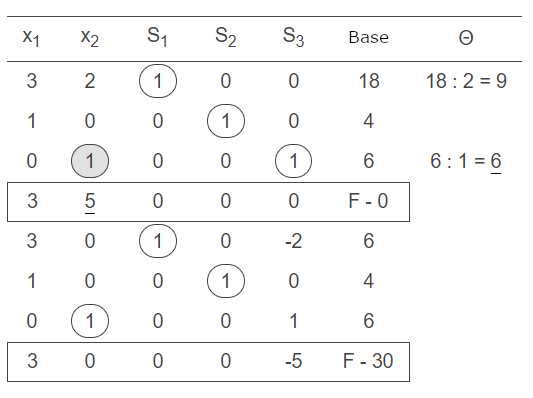
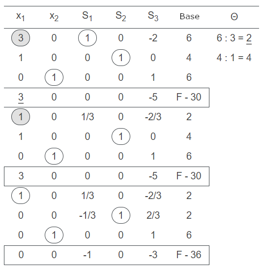
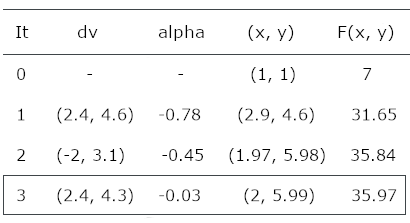

```{r warning=F, message=F, error=F, echo=F}

# Bibliotecas Utilizadas
library(knitr)
library(png)
library(grid)

```

<style>
body {
text-align: justify}
</style>


  _O método de otimização Simplex possui a característica de encontrar a solução exata em um problema de programação linear, porém, em problemas de grande dimensão, o algoritmo apresenta alto custo computacional para atingir a convergência. O método de optimização Pontos Interiores apresenta baixo custo computacional em problemas de grande dimensão, mas apresenta resultados que apenas aproximam a solução ótima. O objetivo deste projeto foi ilustrar o funcionamento desses dois algoritmos, compará-los por meio de simulações para identificar suas vantagens e desvantagens e construir um algoritmo de otimização híbrido que unifica os pontos fortes de cada método._


## __0. Introdução__

* O projeto foi dividido em 6 etapas que objetivam explorar os métodos de Otimização Simplex e Pontos Interiores, comparar os estes métodos com simulações, construir o algoritmo híbrido e comparar a performance dos três métodos.
  1. Método Simplex
    * Desenvolvimento de uma explicação geral, descrição do funcionamento matemático do método, exemplo simples resolvido passo a passo e mecânica da convergência ilustrada graficamente.
  2. Método Pontos Interiores
    * Desenvolvimento de uma explicação geral, descrição do funcionamento matemático do método, exemplo simples resolvido passo a passo e mecânica da convergência ilustrada graficamente.
  3. Simulação Simplex e Pontos Interiores 
    * Desenvolvimento de simulação de todas as combinações de __100__ variáveis com __100__ restrições aleatórias e exibição dos resultados ilustrados em gráficos de número de iterações e diferença entre máximos. 
  4. Método Híbrido 
    * Desenvolvimento de uma explicação sobre a técnica utilizada para construir a união dos 2 métodos e resolver problemas grandes com baixo custo computacional e grande precisão.
  5. Simulação Híbrido
    * Desenvolvimento de simulação para comparar o comportamento do algoritmo híbrido com o Simplex e o Pontos Interiores e exibição dos resultados ilustrados de forma gráfica.
  6. Referências Bibliográficas
    * Indicação de todo o material consultado para o desenvolvimento do projeto.
  
* A biblioteca Scipy da linguagem Python foi utilizada para implementar os algoritmos Simplex e Pontos Interiores. As simulações e o algoritmo híbrido também foram implementadas na linguagem Python. Os gráficos foram produzidos com as bibliotecas Plotly e Seaborn da linguagem Python. O relatório no formato pdf foi produzido no IDE RStudio com a linguagem RMarkdown.   
   

## __1. Método Simplex__

* A ideia básica do simplex é caminhar pelos vértices do politopo de restrições passando de uma base para outra com a utilização de variáveis de folga para encontrar o máximo da função objetivo.

### __Descrição__

* Cada base corresponde a um valor para a função. Um deles é o valor máximo da função __F__. A próxima base será escolhida de forma que o valor da função __F__ não seja menor do que o anterior.

* Uma variável é chamada de variável básica de uma equação se entrar nesta equação com um coeficiente de um e não entrar em outro sistema de equações. Se cada equação tem uma variável básica, pode-se dizer que o sistema tem uma base.

### Funcionamento

* Para alternar as bases são usadas tabelas. Cada linha da tabela é equivalente a uma equação do sistema. O método consiste em escolher a coluna com um coeficiente positivo de forma iterativa para obter um valor da função objetivo que não seja inferior aos seus antecessores.

* Para os coeficientes positivos da coluna selecionada, observa-se o coeficiente $\boldsymbol{\theta}$ e a linha com valor mínimo é selecionada. Quando não existirem mais coeficientes positivos na linha da função o valor máximo pode ser calculado.


### __Exemplo__

* Para ilustrar o funcionamento do algoritmo foi escolhido um problema de __2º dimensão__ representado pelas variáveis $x_1$ e $x_2$ e restringido por __3__ desigualdades do tipo $\le$ representadas pela matriz __A__ e vetor __b__ de valores das restrições. 

* __Função Objetivo:__
  * $f( \hspace{0.1 cm}x_1, \hspace{0.1 cm} x_2 \hspace{0.1 cm}) \hspace{0.2 cm} = \hspace{0.2 cm} 3x_1 + 5x_2$
    
* __Matriz de Restrições:__    
  * $A = \begin{bmatrix} 3x_1+2x_2  \\ x_1  \\ x_2  \end{bmatrix}$
    
* __Vetor Resposta:__    
  * $b = \begin{bmatrix} 18 \\ 4 \\ 6 \end{bmatrix}$
    
* __Domínio__:
  * $x_1 \hspace{0.1 cm} \ge \hspace{0.1 cm} 0$
  * $x_2 \hspace{0.1 cm} \ge \hspace{0.1 cm} 0$
    
    
* Os passos da evolução do algoritmo em direção a convergência do máximo foram representados no formato de tabelas para ilustrar a caminhada pelas bases geradas com a adição de __3__ variáveis de folga (slack) $S_1$, $S_2$ e $S_3$.    
    
* __Iteração 1__
  * Verifica-se que a variável $x_2$ apresenta menor $\theta$ e calcula $f(\hspace{0.1 cm} x_1 = 0 \hspace{0.1 cm}, \hspace{0.1 cm} x_2 = 0 \hspace{0.1 cm}) = 0$.
  * A base inicial será $S_1 = 18$, $S_2 = 4$ e $S_3 = 6$.
  * Transformando $S_3$ para $S_3 = 0$ as bases passam a ser $x_2=6$, $S_1=6$ e $S2=4$.
  * $f( \hspace{0.1 cm} x_1 = 0 \hspace{0.1 cm} , \hspace{0.1 cm} x_2 = 6) = 30$. 


&nbsp;&nbsp;&nbsp;&nbsp;&nbsp;&nbsp;&nbsp;&nbsp;&nbsp;&nbsp;&nbsp;&nbsp;&nbsp;&nbsp;&nbsp;&nbsp;&nbsp;&nbsp;&nbsp;&nbsp;&nbsp;&nbsp;&nbsp;&nbsp;&nbsp;&nbsp;&nbsp;&nbsp;&nbsp;&nbsp;&nbsp;&nbsp;&nbsp;&nbsp;&nbsp;&nbsp;
{width=300px, height=240px}

* __Iteração 2__
  * Verifica-se que a variável $x_1$ apresenta menor $\theta$
  * Transformando a variável $S_1$ para $S_1 = 0$ as bases passam a ser $x_1=2$, $x_2=6$ e $S_2=2$.
  * $f( \hspace{0.1 cm} x_1 = 2 \hspace{0.1 cm} , \hspace{0.1 cm} x_2 = 6 \hspace{0.1 cm} ) = 36$.


&nbsp;&nbsp;&nbsp;&nbsp;&nbsp;&nbsp;&nbsp;&nbsp;&nbsp;&nbsp;&nbsp;&nbsp;&nbsp;&nbsp;&nbsp;&nbsp;&nbsp;&nbsp;&nbsp;&nbsp;&nbsp;&nbsp;&nbsp;&nbsp;&nbsp;&nbsp;&nbsp;&nbsp;&nbsp;&nbsp;&nbsp;&nbsp;&nbsp;&nbsp;&nbsp;&nbsp;
{width=310px, height=340px}

* __Resultado__
  + A primeira e segunda colunas apresentaram valores pivôs na primeira e terceira linhas indicando a posição no vértice __(2,6)__ como solução de máximo da função objetivo. 

### __Convergência__

* Para ilustrar o caminho do algoritmo Simplex no espaço de busca foi utilizado o pacote Plotly que permitiu a construção de uma figura com 3 dimensões.

* A variável $x_1$ do problema foi representada pelo eixo __x__ do gráfico, a variável $x_2$ do problema foi representada pelo eixo __y__ do gráfico e a imagem da função objetivo foi representada pelo eixo __z__ do gráfico.

* O __politopo__ de segunda dimensão formado pelas restrições do problema foi representado por __semiplanos__ na cor vermelha que se expandem sobre o eixo __z__ onde a função objetivo assume valores correspondentes à posição dos vértices do politopo.

* O caminho do algoritmo pelos vértices do politopo para convergência do valor máximo da função objetivo foi representado pelos círculos na cor verde verde.

   
```{r warning=F, message=F, error=F, echo=F, fig.align='center',  out.width='95%'}

# Carrega imagem
img <- readPNG("imagens/simplex_sol.png")

# Imprime imagem
grid.raster(img)

```

* O algoritmo inicia no infinito considerando a função objetivo sem restrições.

* 1º Atinge o vértice __x = 0__ e __y = 6__ com __f(x, y) = 30__.

* 2º Atinge o vértice __x = 2__ e __y = 6__ convergindo para __max f(x, y) = 36__.

* O funcionamento do algoritmo animado pode ser visualizado no link:
  + [\textcolor{blue}{https://colab.research.google.com}](https://colab.research.google.com/drive/1ekh8LM5FRlb4nAovQX-pHYn3mT_oWdg6?usp=sharing)

## __2. Método Pontos Interiores__

* A ideia principal do algoritmo de Pontos Interiores é caminhar internamente no politopo nas melhores direções sem violar a fronteira de restrições com intuito de convergir rapidamente para um valor próximo do máximo da função objetivo.

### __Descrição__

* Para inicializar o algoritmo é escolhido um vetor $X_0$ arbitrariamente definido diferente do vetor nulo e uma variável $\gamma \in [0,1]$ que controla a distância percorrida em cada passo.

* Quando o algoritmo é iniciado é calculada a distância do ponto em relação a cada restrição. A parte mais importante do algoritmo é o uso da álgebra linear para calcular a direção que gera maior crescimento monótono da função objetivo utilizando a técnica de derivada direcional.

### __Funcionamento__

* __Passo 1__:
  + Escolher $x^0$ diferente do vetor nulo para ser o ponto inicial dentro do politopo e escolher uma variável $\gamma$ de forma que:
  + $Ax^0 < b \hspace{0.3 cm} e \hspace{0.3 cm} 0 < \gamma < 1, \hspace{0.3 cm} k = -1$
  
* __Passo 2__:
  + Calcular a folga, ou seja, a distância do ponto em relação à cada restrição indicando __k = k + 1__.
  + $v^k \hspace{0.2 cm} = \hspace{0.2 cm} b - Ax^k \hspace{0.2 cm} = \hspace{0.2 cm} [v_1^k, v_2^k, ..., v_m^k]^T$

* __Passo 3__:
  + Calcular a matriz diagonal.
  + $D_k \hspace{0.2 cm} = \hspace{0.2 cm} diag \hspace{0.2 cm}[\frac{1}{v_1^k}, \frac{1}{v_2^k}, ..., \frac{1}{v_m^k} ]$
  
* __Passo 4__:
  + Calcular a projeção na fronteira da esfera.
  + $(A^T \hspace{0.2 cm} D_K \hspace{0.2 cm} D_k \hspace{0.2 cm} A) \hspace{0.2 cm} d_x^k \hspace{0.2 cm} = \hspace{0.2 cm} c$
  
* __Passo 5__:
  + Escalar a direção projetada $d_x^k$
  + $d_v^k \hspace{0.2 cm} = \hspace{0.2 cm} - A \hspace{0.2 cm} d_x^k \hspace{0.2 cm}  [ \hspace{0.2 cm} (dv)_1, \hspace{0.2 cm} (dv)_2, \hspace{0.2 cm} ..., \hspace{0.2 cm} (dv)_m \hspace{0.2 cm} ]^T$
  
* __Passo 6__:
  + Calcular o tamanho da caminhada na direção escolhida.
  + $\alpha \hspace{0.2 cm} =  \hspace{0.2 cm} \gamma \hspace{0.2 cm} MAX \hspace{0.1 cm} ( \hspace{0.2 cm} \frac{v_i^k}{(d_v)_i} \hspace{0.2 cm} < \hspace{0.2 cm} 0 \hspace{0.2 cm})$
  
* __Passo 7__:
  + Calcular novo ponto interior
  + $x^{k + 1} \hspace{0.2 cm} = \hspace{0.2 cm} x^k - \alpha \hspace{0.1 cm} d_x^k$
  
* __Passo 8__:
  + Verificar parada das interações do algoritmo quando encontrar uma diferença entre a última solução e a anterior inferior à tolerância arbitrariamente definida.
  + $\frac{|\hspace{0.2 cm} b^T \hspace{0.2 cm} Y^k \hspace{0.2 cm} - \hspace{0.2 cm} c^T \hspace{0.2 cm} x^k \hspace{0.2 cm}  |}{MAX \hspace{0.1 cm}( \hspace{0.2 cm}1 \hspace{0.2 cm} | \hspace{0.2 cm} c^T \hspace{0.2 cm} x^k \hspace{0.2 cm} )} < \epsilon$


### __Exemplo__

* Foi utilizado o mesmo problema do algoritmo Simplex para comparação das mecânicas e resultados.


&nbsp;&nbsp;&nbsp;&nbsp;&nbsp;&nbsp;&nbsp;&nbsp;&nbsp;&nbsp;&nbsp;&nbsp;&nbsp;&nbsp;&nbsp;&nbsp;&nbsp;&nbsp;&nbsp;&nbsp;&nbsp;&nbsp;&nbsp;&nbsp;&nbsp;&nbsp;&nbsp;&nbsp;&nbsp;&nbsp;&nbsp;&nbsp;&nbsp;&nbsp;&nbsp;&nbsp;
{width=295px}

### __Convergência__

* O mesmo gráfico em terceira dimensão foi utilizado para ilustrar a mecânica do algoritmo Pontos Interiores.


```{r warning=F, message=F, error=F, echo=F,  out.width='90%', fig.align='center'}

# Carrega imagem
img <- readPNG("imagens/pi_sol.png")

# Imprime imagem
grid.raster(img)

```

* O algoritmo inicia no ponto $x_0 = (1,1)$ com f(x, y) = 8.

* 1º Caminha para o ponto __x = 2.89__ e y = __4.59__ com __f(x, y) = 31.65__.

* 2º Caminha para o ponto __x = 1.97__ e __y = 5.98__ com __f(x, y) = 35.84__.

* 3º Caminha para o ponto __x = 2__ e __y = 5.99__ convergindo para __max f(x, y) = 35.97__.

* O funcionamento do algoritmo animado pode ser visualizado no link:
  + [\textcolor{blue}{https://colab.research.google.com}](https://colab.research.google.com/drive/1BOzxQ00lfWQLUeNCH3aON1aBCOi7Q87G?usp=sharing)

## __3. Simulação Simplex e Pontos Interiores__

* Para comparar a performance dos dois métodos no que diz respeito ao número de iterações e convergência de problemas com diferentes dimensões, foi desenvolvido uma simulação com __5000__ amostras no espaço de dimensões __[2, 100]__ variáveis e __[1, 100]__ restrições.

### __Descrição__

* As amostras foram aleatoriamente sorteadas nos intervalos __[0, 100]__ para as restrições, __[10, 100]__ para o lado direito das desigualdades e __[1, 100]__ para a função objetivo. Amostras com muito mais restrições do que variáveis apresentaram redundância e ou valor máximo muito próximo de zero, portanto a simulação foi desenhada com um número de restrições menor ou igual ao número de variáveis. A mesma amostra foi utilizada uma vez em cada método.

### __Mapa de Calor Iterações Simplex__

* O eixo __x__ foi utilizado para representar o número de variáveis do problema. No eixo __y__ foi representado o número de restrições do problema. O __gradiente__ das cores vermelho até azul foi utilizado para representar o número de iterações gastas para convergência. 

```{r warning=F, message=F, error=F, echo=F, out.width='100%', fig.align='center'}

# Carrega imagem
img <- readPNG("imagens/simplex_sim.png")

# Imprime imagem
grid.raster(img)

```

* Dimensões de até __30__ variáveis e __30__ restrições apresentaram custo inferior a __100__ iterações.

* Dimensões de __30__ até __60__ apresentaram custo entre __100__ e __300__ iterações.

* Dimensões superiores a __60__ apresentaram custo computacional de __300__ até __600__ iterações.

### __Mapa de Calor Iterações Pontos Iteriores__

* O gráfico do tipo mapa de calor foi produzido para ilustrar os resultados do número de iterações da simulação Pontos Interiores. No eixo __x__ foi representado o número de variáveis do problema. No eixo __y__ foi representado o número de restrições do problema. O __gradiente__ das cores vermelho até azul foi utilizado para representar o número de iterações gastas para convergência. 

```{r warning=F, message=F, error=F, echo=F, out.width='100%', fig.align='center'}

# Carrega imagem
img <- readPNG("imagens/pi_sim.png")

# Imprime imagem
grid.raster(img)

```


* Dimensões de até __30__ variáveis e __30__ restrições apresentaram custo inferior a __10__ iterações.

* Dimensões de __30__ até __60__ apresentaram custo entre __10__ e __15__ iterações.

* Dimensões superiores a __60__ apresentaram custo computacional de __15__ até __20__ iterações.

### __Comparação de Custo Computacional__

* Dimensões de até __30__ variáveis e restrições, o Simplex apresentou custo de __5__ até __8__ vezes maior.

* Dimensões de __30__ até __60__ variáveis e restrições, o Simplex apresentou custo de __8__ até __13__ vezes maior.

* Dimensões de __60__ até __100__ variáveis e restrições, o Simplex apresentou custo de __20__ até __25__ vezes maior.

* Pontos Interiores apresentou maior mistura de custos, com destaque para correlação positiva da iteração com aumento do número de variáveis. Simplex apresentou regiões mais bem definidas, com poucas observações discrepantes e correlação semelhante com as duas variáveis.


### __Mapa de Calor Diferença de Máximos__

* No eixo __x__ foi representado o número de variáveis do problema. No eixo __y__ foi representado o número de restrições do problema. O __gradiente__ das cores vermelho até azul foi utilizado para representar a diferença entre os máximos de cada método. 

* O resultados das diferenças foram transformados para escala $log_{10}$ devido à distribuição assimétrica.


```{r warning=F, message=F, error=F, echo=F, out.width='100%', fig.align='center'}

# Carrega imagem
img <- readPNG("imagens/dif_pi_simplex_sim.png")

# Imprime imagem
grid.raster(img)

```

* Dimensões com __1__ até __10__ restrições apresentaram mais diferenças na ordem de $[10^{-6}, 10^{-4}]$.

* Dimensões superiores a __10__ restrições apresentaram dispersão aleatória de diferenças.

* A amplitude de diferenças apresentou variação $[10^{-11}, 10^{-4}]$.

* A magnitude entre a maior e a menor diferença foi da ordem de $10^{-7}$.


### __Comparação de Máximos__


* O algoritmo Simplex apresentou máximos superiores na ordem de até $10^{-4}$ em relação a performance do algoritmo de Pontos Interiores.

* A maioria, ou 90% das diferenças encontradas, foram iguais ou inferiores $10^{-6}$. Tal fato indica que apenas em problemas que demandam extrema precisão científica o máximo encontrado pelo algoritmo de Pontos Interiores poderia ser considerado um erro na precisão da solução.

## __4. Método Híbrido__

* A ideia fundamental do método híbrido é unificar as qualidades dos métodos Pontos Interiores e Simplex. Para tanto é preciso chavear os dois métodos. 

### __Descrição__

* O algoritmo começa com o algoritmo de Pontos Interiores para aproximar o vértice que maximiza a função objetivo. Como o Pontos Interiores só procura soluções em pontos internos do politopo, é realizado um chaveamento para projetar o último ponto interior em um vértice do politopo. Finalmente o algoritmo Simplex é iniciado a partir deste ponto. 

### __Funcionamento__

* O chaveamento foi realizado arredondando para cima as coordenados do último ponto interior para ser o $x_0$ do Simplex.

### __Exemplo__

* Foi utilizado o mesmo problema dos algoritmos Simplex e Pontos Interiores para comparação das mecânicas e resultados. O mesmo gráfico em terceira dimensão foi utilizado para ilustrar a mecânica do algoritmo Híbrido. A única diferença foi que a reta na cor verde representa o algoritmo Pontos Interiores e o ponto na cor verde representa o Simplex.

```{r warning=F, message=F, error=F, echo=F}

# Carrega imagem
img <- readPNG("imagens/hibrido_sol.png")

# Imprime imagem
grid.raster(img)

```

* O algoritmo Pontos Interiores gasta 2 iterações para aproximar o vértice de máximo.

* Os pontos x = 1.97 e y = 5.82 são arredondados para cima.

* O algoritmo Simplex foi iniciado nos pontos x = 2 e y = 6.

* Neste ponto o algoritmo já apresenta solução de máximo sem gastar iterações. 

## __5. Simulação Híbrido__

* A simulação do método híbrido foi realizada com o mesmo tamanho de problemas que as simulações realizadas para o algoritmo Simplex e o algoritmo Pontos Interiores.

```{r warning=F, message=F, error=F, echo=F, out.width='100%', fig.align='center'}

# Carrega imagem
img <- readPNG("imagens/hibrido_sim.png")

# Imprime imagem
grid.raster(img)

```


## __6. Referências__

* Dantzig, George Bernard, "The Simplex Method" Santa Monica, CA: RAND Corporation, 1956. 

* A. Vannelli, "Teaching large-scale optimization by an interior point approach" in IEEE Transactions on Education, vol. 36, no. 1, pp. 204-209, Feb. 1993, doi: 10.1109/13.204847.


